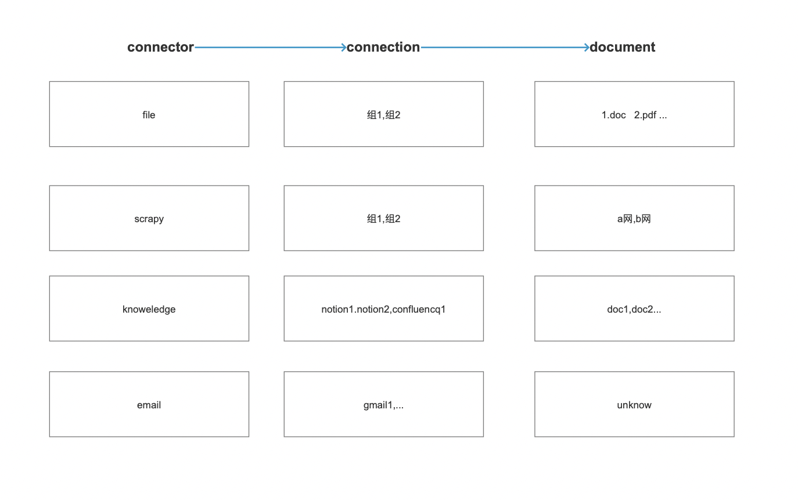
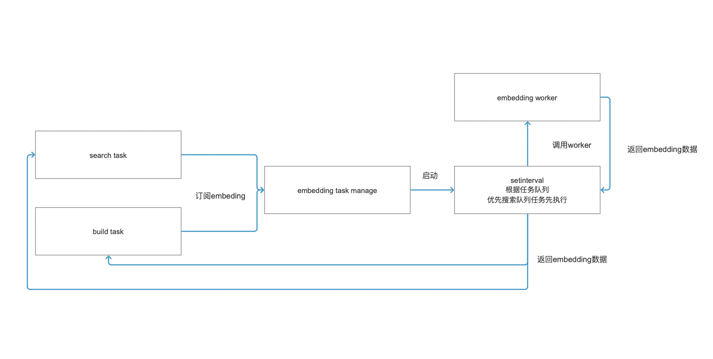
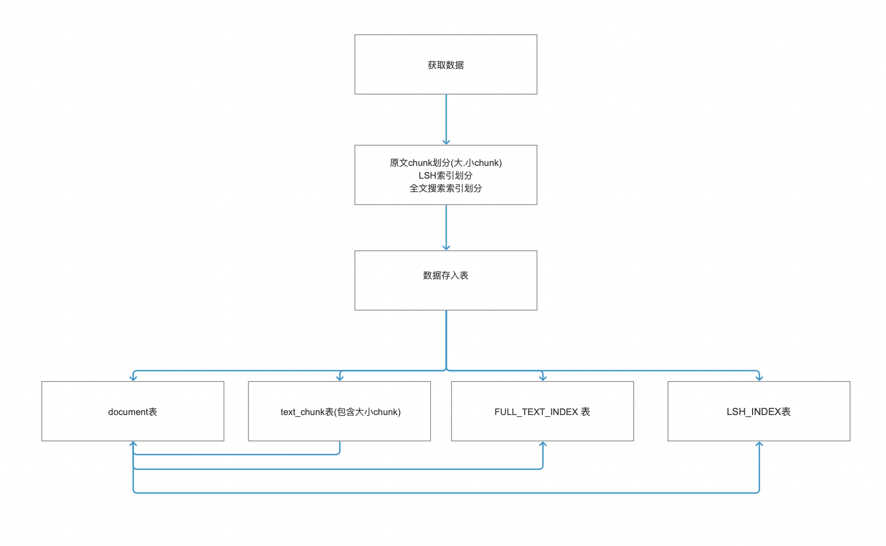
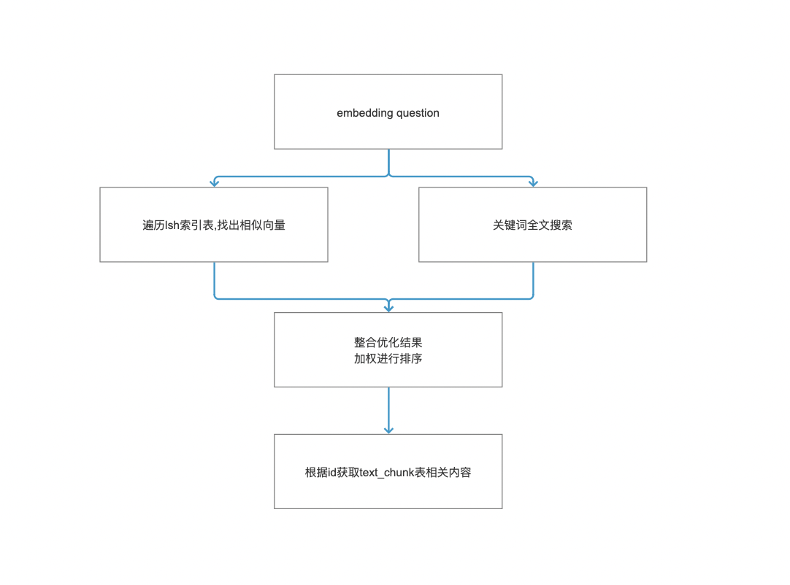

# Ncurator

[](https://www.ncurator.com/en)
[](https://help.ncurator.com/en/)
[](./README.md)

**Ncurator** is a privacy-focused local knowledge base AI Q&A assistant, designed as a browser extension. It focuses on building personal knowledge bases and integrating with web pages. It allows you to import documents, crawl webpages, import browser bookmarks, etc., to build your own knowledge base. You can then interact with your knowledge through AI for Q&A, search, and analysis. All data is stored locally, ensuring privacy.

**Website**：[https://www.ncurator.com/en](https://www.ncurator.com/en)

**Documentation**：[https://help.ncurator.com/en/](https://help.ncurator.com/en/)

**Chrome Extension Download**：[https://chromewebstore.google.com/detail/ncurator-your-local-knowl/jdlfflbeekclkgcckcfombmfojmcdeio?hl=en](https://chromewebstore.google.com/detail/ncurator-your-local-knowl/jdlfflbeekclkgcckcfombmfojmcdeio?hl=en)

**Edge Extension Download**：[https://microsoftedge.microsoft.com/addons/detail/hkdfdbpkmkpooopbkdghecbaipeoijpj](https://microsoftedge.microsoft.com/addons/detail/hkdfdbpkmkpooopbkdghecbaipeoijpj)

**Web Version Experience**：[https://ai.ncurator.com/](https://ai.ncurator.com/)

**Web Version Repository**：[https://github.com/Yoan98/ncurator-web](https://github.com/Yoan98/ncurator-web)


## 🙏 Acknowledgements

Ncurator's development was made possible and inspired by these excellent open-source projects:

*   **Chrome Extension Framework**: [Jonghakseo/chrome-extension-boilerplate-react-vite](https://github.com/Jonghakseo/chrome-extension-boilerplate-react-vite?tab=readme-ov-file) - An outstanding browser extension template using React + Vite + TypeScript.
*   **Web LLM**: [mlc-ai/web-llm](https://github.com/mlc-ai/web-llm) - A new project bringing LLMs to the browser.
*   **LangChainJS**: [langchain-ai/langchainjs](https://github.com/langchain-ai/langchainjs) - A library for rapidly developing applications like knowledge bases.
*   **Danswer**: [danswer-ai/danswer](https://github.com/danswer-ai/danswer) - An awesome open-source knowledge base project.

Special thanks to the developers and contributors of these projects!

## ✨ Features

*   **Easy Get Started**: No complex setup required, use it right after download.
*   **Data Security**: All data is stored only on your local device.
*   **Free AI**: Option to choose local LLM models for free AI capabilities.
*   **Browser Integration**: Provides a convenient user experience as a browser extension.
*   **Unlimited Documents**: The number of documents is limited only by your local device storage.
*   **Offline Use**: Can be used completely offline after downloading the model.
*   **Multi-source Import**: Supports PDF, DOCX, web crawling, browser bookmarks, Notion, Gmail, Google Drive, etc.
*   **Intelligent Q&A**: Based on semantic and keyword search, intelligently understands questions and retrieves information from the knowledge base.

## 🏗️ Architecture Diagram

Below are the main architecture flow diagrams for Ncurator:

#### Data Classification
Connector -> Link Group -> Document


#### Embedding Flow
Used to share memory under multi-worker embedding to avoid memory explosion


#### Storage


#### Query Flow


## 🚀 Quick Start

**Prerequisites:**

*   Node.js >= 18.19.1

**Steps:**

1.  **Clone the repository:**
    ```bash
    git clone https://github.com/Yoan98/Ncurator.git
    cd ncurator
    ```

2.  **Install dependencies:**
    ```bash
    pnpm install
    ```

3.  **Start the development environment:**
    *   **Chrome:**
        ```bash
        pnpm dev
        ```
    After starting the development mode, load the `dist/` directory as an unpacked extension in your browser according to the terminal prompts.

## 📦 Build

1.  **Build the extension:**
    *   **Chrome:**
        ```bash
        pnpm build
        ```
    The build artifacts will be located in the `dist/` directory.

## 📁 Project Structure

```
.
├── chrome-extension/    # Chrome extension core code
├── dist/                # Build output directory
├── pages/               # Web version or internal plugin pages
├── tests/               # Test code
├── package.json         # Project dependencies & scripts config
└── turbo.json           # Turborepo config
```

## Next Steps
- Support deleting and re-downloading local models.
- Add API keys for Doubao (Chinese LLM) and Kimi AI, improve documentation for configuring API keys.
- Add functionality to upload embedding models, enabling users in China (without VPNs) to use them.
- Remove the requirement to configure AI for search functionality.
- Remove limitations on bookmark import.
- Support downloading and importing files when a web file URL is entered during crawler configuration (currently only crawls HTML).
- Support data migration (currently planned as exporting to a file, then importing on another computer or browser).
- Support changing storage drive (currently stores on C: drive in Windows, unsure if switching is possible).
- Support local Ollama requests.

(The author has been a bit lazy recently, wondering if any developers are interested in contributing. Many thanks!)

## 🤝 Contributing

Contributions of all kinds are welcome! You can:

*   Report Bugs
*   Request Features
*   Submit Pull Requests

Please ensure you follow the project's code style and contribution guidelines (if they exist).

## 📄 License

[MIT](./LICENSE)

---

Made with ❤️ by Yoan Huang

## Contact

*   Author Email: xiaoyuan9816@gmail.com
*   QQ: 891209383
*   X: [Yoan_Huang](https://x.com/Yoan_Huang)