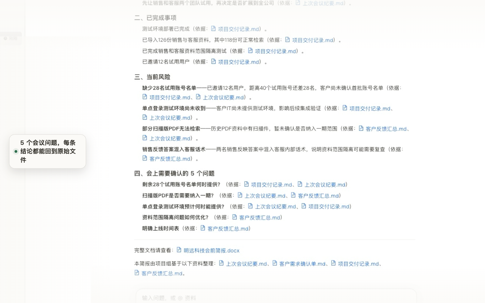

# Ncurator

<p align="center">
  
</p>

<p align="center">
  Your AI work partner. Give Ncurator a task and let it help you finish it.
</p>

<p align="center">
  <a href="https://www.ncurator.com/en">Website</a> ·
  <a href="https://www.ncurator.com/en/manual">Manual</a> ·
  <a href="./README.md">中文</a>
</p>

<p align="center">
  <a href="https://download.ncurator.com/downloads/latest/windows-x64.exe">Download for Windows</a> ·
  <a href="https://download.ncurator.com/downloads/latest/macos-arm64.dmg">Download for macOS (Apple silicon)</a> ·
  <a href="https://download.ncurator.com/downloads/latest/macos-x64.dmg">Download for macOS (Intel)</a>
</p>

<div align="center">
  <video controls muted loop playsinline width="100%" poster="https://www.ncurator.com/media/ncurator-customer-meeting-poster.jpg" aria-label="Ncurator product demo">
    <source src="https://www.ncurator.com/media/ncurator-customer-meeting.mp4" type="video/mp4" />
    Your browser does not support video playback. Watch the demo on the <a href="https://www.ncurator.com/en">official website</a>.
  </video>
</div>

Ncurator is a desktop AI assistant for everyday knowledge work. It can find information in a workspace, use a local knowledge base, search the web, operate a browser, and help with document tasks. The desktop app is available for macOS and Windows.

> This repository contains the Ncurator browser extension source only. The desktop app is a separate product. Visit the website for downloads, help, and feedback.

## Desktop app

### Delegate a task, then let Ncurator work

Give Ncurator a task and the materials it needs. It can use files in your workspace, your knowledge base, and web information to move the work forward. It is designed for tasks such as organizing materials, extracting conclusions, finding information, and creating documents.

### Work with your local knowledge base

A workspace can include local folders and, when needed, URLs. Ncurator indexes those materials and retrieves relevant information while answering questions or completing tasks. Update the index when your files or configured web content changes.



### Choose your own model and costs

The desktop app is free to use. Configure your own model endpoint and API key, then pay your chosen model provider for actual usage. To use the knowledge base, download a vector model first. Retrieval can reduce the tokens used when Ncurator looks through local material.

You can select a main model and a vision model separately. Vision models can read JPG, JPEG, PNG, WebP, GIF, and BMP images in the current workspace.

## Capabilities

| Capability | Status | Notes |
| --- | --- | --- |
| Autonomous AI tasks | Available | Carries out tasks in a workspace |
| Local knowledge base | Available | Indexes and retrieves local folders and optional URLs |
| Web search | Available | Finds public web information |
| Browser use | Available | Uses a browser as part of a task |
| DOCX | Available | Reads and handles Word document tasks |
| PowerPoint | Available | Handles presentation tasks |
| PDF | Read only | Reads PDF content |
| Excel | Available | Handles spreadsheet tasks |
| Collaborative memory | In development | Still being improved |
| Browser bookmarks | Extension required | Available after installing the extension below |

## Get started in three steps

1. Download and install the desktop app for your device.
2. Add a model endpoint and API key in Ncurator.
3. Create a workspace and configure the local folders Ncurator can use. To use the knowledge base, download a vector model and update the index.

See the [official manual](https://www.ncurator.com/en/manual) for setup details, vision models, and macOS installation help.

## Browser extension

The browser extension is a lightweight bookmark utility for your information-organizing workflow:

- View bookmark titles, folder paths, and URLs, including nested folders.
- Copy every bookmarked URL in one click, one URL per line, while preserving browser order.
- Requests only the `bookmarks` permission and never creates, changes, or deletes bookmarks.
- Processes bookmark data locally in the browser. It does not upload, track, or exchange bookmark data with the desktop app.

<p>
  <a href="https://chromewebstore.google.com/detail/ncurator-knowledge-base-a/jdlfflbeekclkgcckcfombmfojmcdeio?hl=zh-CN">Install for Chrome</a> ·
  <a href="https://microsoftedge.microsoft.com/addons/detail/hkdfdbpkmkpooopbkdghecbaipeoijpj">Install for Microsoft Edge</a>
</p>

## This repository

This repository maintains the Ncurator browser extension for Chrome and Microsoft Edge with Manifest V3. The extension does not depend on the desktop app, and the desktop app does not read bookmark data from the extension.

### Local development

```bash
npm install
npm run dev
```

In Chrome, enable Developer mode on the extensions page and load `.output/chrome-mv3`. For Edge:

```bash
npm run dev:edge
```

Then load `.output/edge-mv3`.

### Verify and build

```bash
npm run check
npm run zip:stores
```

More development documentation:

- [Browser extension architecture](./docs/architecture.md)
- [Chrome and Edge store release](./docs/release.md)
