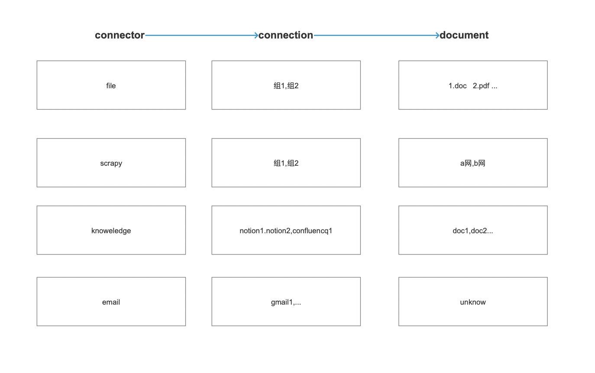
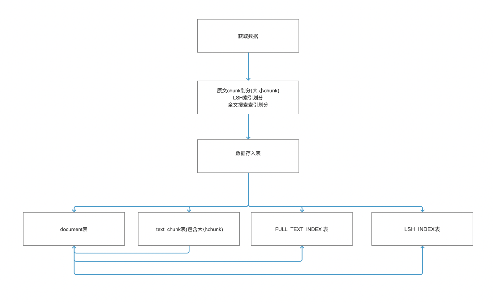
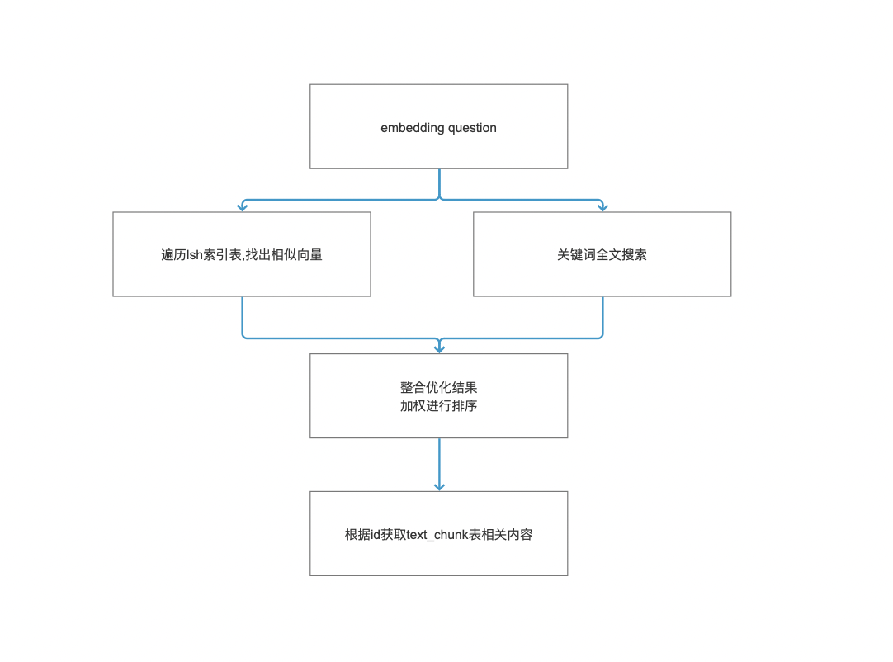

# Ncurator (馆长)

<p align="center">
  
</p>

[](https://www.ncurator.com/zh)
[](https://help.ncurator.com/zh/)
[](./README.en.md)

**Ncurator (馆长)** 是一款注重隐私的本地知识库 AI 问答助手,以浏览器插件的形式存在,专注于打造个人知识库且与网页结合的方向。

它允许你导入文档、爬取网页、浏览器书签导入等方式，构建属于你自己的知识库。随后，你可以通过 AI 与你的知识进行对话、搜索和分析。

所有数据均保存在本地，确保隐私安全。

**官网**：[https://www.ncurator.com/zh](https://www.ncurator.com/zh)

**文档**：[https://help.ncurator.com/zh](https://help.ncurator.com/zh)

**Chrome 插件下载**：[https://chromewebstore.google.com/detail/ncurator-your-local-knowl/jdlfflbeekclkgcckcfombmfojmcdeio?hl=zh-CN&utm_source=ext_sidebar](https://chromewebstore.google.com/detail/ncurator-your-local-knowl/jdlfflbeekclkgcckcfombmfojmcdeio?hl=zh-CN&utm_source=ext_sidebar)

**Edge 插件下载**：[https://microsoftedge.microsoft.com/addons/detail/hkdfdbpkmkpooopbkdghecbaipeoijpj](https://microsoftedge.microsoft.com/addons/detail/hkdfdbpkmkpooopbkdghecbaipeoijpj)

**网页版体验**：[https://ai.ncurator.com/](https://ai.ncurator.com/)

**网页版仓库**：[https://github.com/Yoan98/ncurator-web](https://github.com/Yoan98/ncurator-web)

## 🎬 Demo 演示
<p align="center">
  <video controls width="80%">
    <source src="./assets/search_demo_zh.webm" type="video/webm">
    抱歉，你的浏览器不支持嵌入式视频。
  </video>
</p>

## 🙏 致谢

Ncurator 的诞生离不开以下优秀开源项目的支持和启发：

*   **Chrome 扩展框架**: [Jonghakseo/chrome-extension-boilerplate-react-vite](https://github.com/Jonghakseo/chrome-extension-boilerplate-react-vite?tab=readme-ov-file) - 一个出色的 React + Vite + TypeScript 浏览器扩展模板。
*   **Web LLM**: [mlc-ai/web-llm](https://github.com/mlc-ai/web-llm) - 将LLM带到浏览器端的新项目。
*   **LangChainJS**: [langchain-ai/langchainjs](https://github.com/langchain-ai/langchainjs) - 快速开发知识库等应用的库。
*   **Danswer**: [danswer-ai/danswer](https://github.com/danswer-ai/danswer) - 一个开源又牛逼的知识库项目。


特别感谢这些项目的开发者和贡献者！


## ✨ 特性

*   **轻松上手**: 无需复杂设置，下载即用。
*   **数据安全**: 所有数据仅保存在你的本地设备上。
*   **免费 AI**: 可选择本地 LLM 模型，实现免费 AI 功能。
*   **浏览器集成**: 作为浏览器插件，提供便捷的使用体验。
*   **无限文档**: 文档数量仅受你本地设备存储空间的限制。
*   **离线使用**: 下载模型后可完全离线使用。
*   **多源导入**: 支持 PDF, DOCX, 网页爬取, 浏览器书签等。
*   **智能问答**: 基于语义和关键词搜索，智能理解问题并从知识库检索信息。

## 💻 设备配置建议

*   **基本要求**: 8GB 内存或以上即可流畅运行 Ncurator。
*   **本地大模型 (Local LLM)**: 若需使用本地大语言模型进行 AI 问答，强烈建议你的设备配备独立显卡 (GPU)，以获得更好的性能体验。内存建议 16GB 或以上。

## 🏗️ 架构图

以下是 Ncurator 的主要架构流程图：

#### 数据分类
连接器 -> 每组链接 -> 文档


#### 嵌入流程 (Embedding)
用于共享多worker的embedding下的内存,避免内存爆炸


#### 存储 (Storage)


#### 查询 (Query)


## 🚀 快速开始

**环境要求:**

*   Node.js >= 18.19.1

**步骤:**

1.  **克隆仓库:**
    ```bash
    git clone https://github.com/Yoan98/Ncurator.git
    cd ncurator
    ```

2.  **安装依赖:**
    ```bash
    pnpm install
    ```

3.  **启动开发环境:**
    *   **Chrome:**
        ```bash
        pnpm dev
        ```
    开发模式启动后，根据终端提示将 `dist/` 目录作为未打包的扩展程序加载到你的浏览器中。

## 📦 构建

1.  **构建插件:**
    *   **Chrome:**
        ```bash
        pnpm build
        ```
    构建产物将位于 `dist/` 目录下。


## 📁 项目结构

```
.
├── chrome-extension/    # Chrome 扩展核心代码
├── dist/                # 构建输出目录
├── pages/               # 网页版或插件内部页面
├── tests/               # 测试代码
├── package.json         # 项目依赖与脚本配置
└── turbo.json           # Turborepo 配置
```

## 📝 下一步
- 本地模型支持删除,重新下载
- 增加豆包，kimi的key，加强配置api key的文档
- 上传embedding模型功能,让国内用户(没梯子的用户)能用
- 剔除搜索一定要配置ai
- 书签导入去掉限制
- 支持爬虫配置时,填入网络文件地址时,能下载导入该文件(目前只是爬取html)
- 支持数据迁移(目前构思的是,导出成文件,然后可在其他电脑端或浏览器端导入)
- 支持更换存储盘(目前是存储在C盘(windows下),还不知道能否切换)
- 支持本地ollam请求

(最近作者有点懒,不知道有没大佬有兴趣愿意贡献下,万分感谢)
## 🤝 贡献

欢迎各种形式的贡献！你可以：

*   报告 Bug
*   提交功能请求
*   发送 Pull Request

请确保遵循项目的代码规范和贡献指南（如果存在）。


## 📄 许可证

[MIT](./LICENSE)

---

Made with ❤️ by [Yoan](https://github.com/Yoan98)

## 📞 联系方式

*   作者邮箱: xiaoyuan9816@gmail.com
*   QQ: 891209383
*   X: [Yoan_Huang](https://x.com/Yoan_Huang)